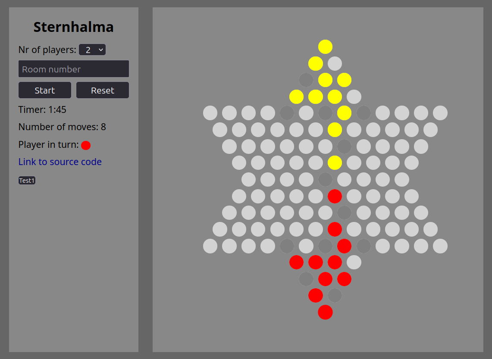
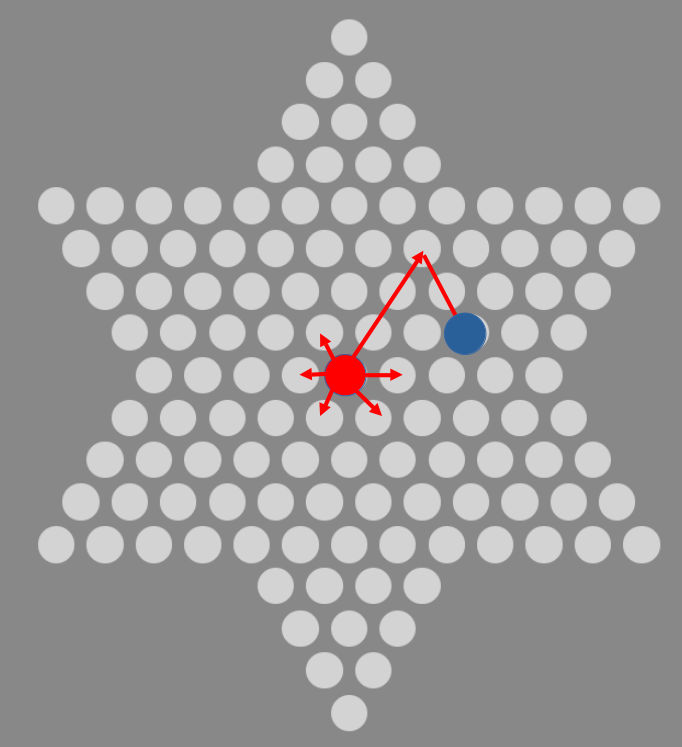

# Sternhalma / Chinese Checker
## Description
[Link to play the game](https://sternhalma.onrender.com)

Chinese Checker is a popular strategy board game in China, it was also my favorite game in my school time. It can be played by 1-6 person. The player try to move all the 10 pieces to the opposite corner of the board. One piece could be moved to an adjacent field or jump over ONE other piece once or for more times, but not jump over more than one piece.

## Components
Frontend is built by React. Backend is built by Django.

Defining each position of the board is a little tricky. They are defined by three numbers.
- First number defines to which direction it goes away from the center. There are six possible directions.
- Second number defines how far it goes away from the center
- Third number defines how far it goes after turning right

The coordinate of the blue point would be (1,3,2)

